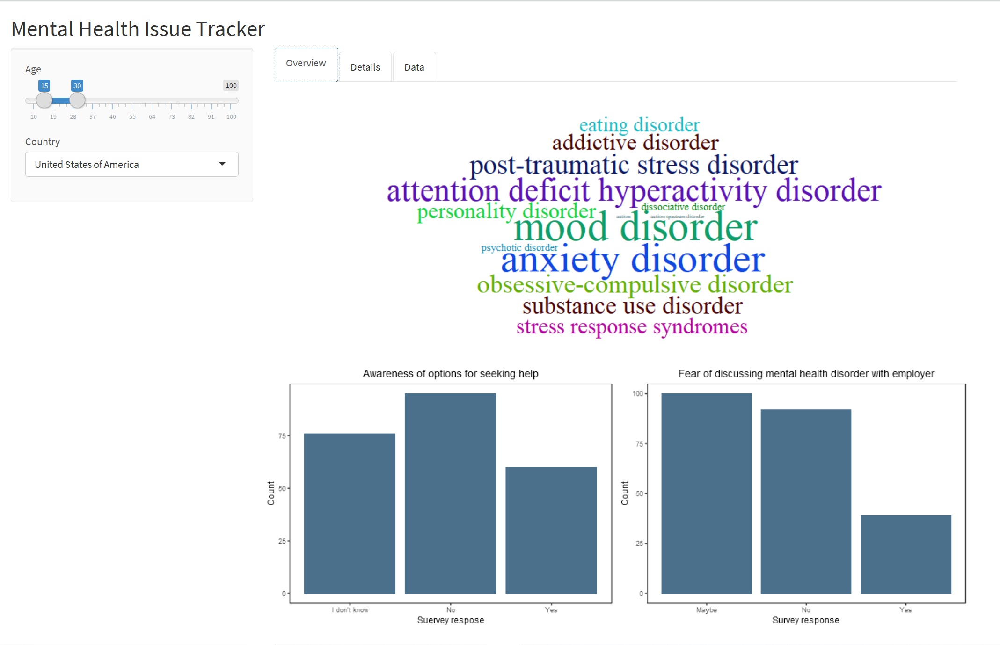
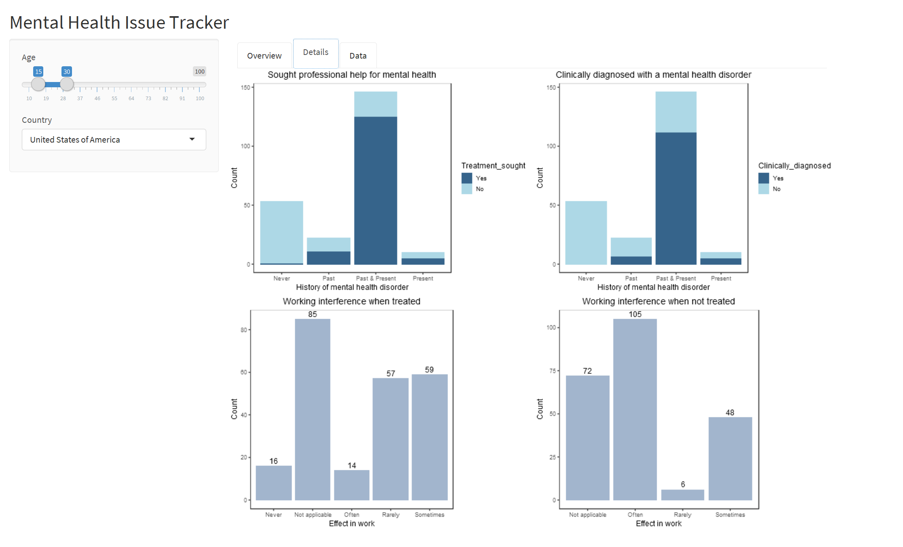
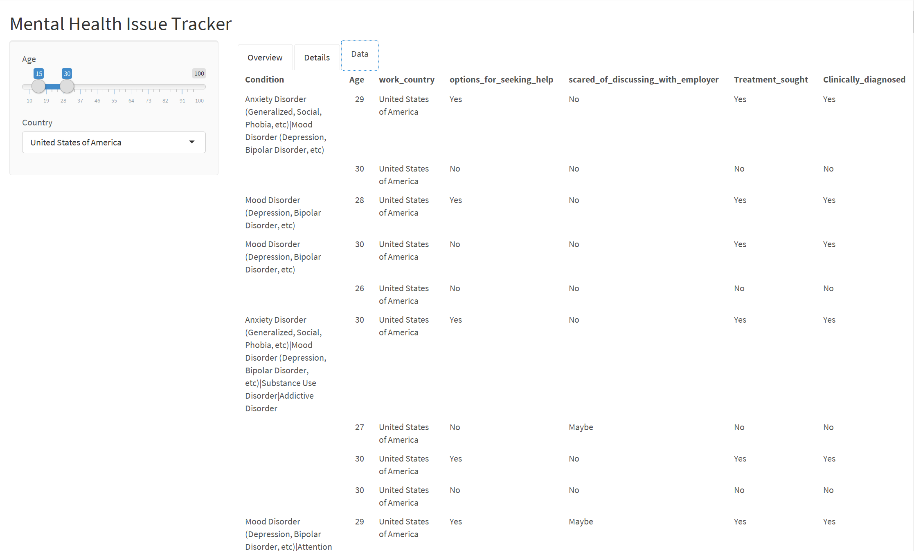

# Milestone 2

### Application walkthrough

Our foundation to set up this <a href="https://marcelle-sayanti.shinyapps.io/mental_health_issue_tracker/"> app </a> is to give users an overview of the data with a Summary of the awareness among employees and also to look in Detail and analyze the data which will help the user to build a plan to mitigate the challenge.

#### Tab Rationale

**Overview**   

Our landing page gives the most common mental health issues among the employees in the form of a word cloud. We implemented wordcloud2 which shows the most frequently occurring mental health disorders. Along with that, for the employer to get a clear idea about awareness among the employees regarding the benefit options given by the organization for mental health we generated a plot with the count of employees with respect to their awareness. We used bar plots to provide the visual. We believe that awareness could be raised only if people are not afraid to communicate and reach out, hence to visualize how much employees are comfortable to reach out for help by communicating with the employer, we developed a bar plot with the count of employees with respect to their comfort level to communicate with employer regarding their mental health issue.

**Detail**  

Analyzing the data to know more about the employee’s past and present health diagnoses is as important as to know if they have been treated clinically. This will give the employer the information of how many employees need more encouragement to seek professional help. To visualize these we developed two charts, one which depicts employee with medical illness history with respect to if they have been clinically diagnosed.Another chart depicts medical history with respect to if they are getting professional help.

Mental health has adverse effect in work and performance of employees. To understand that we developed two charts , one which depicts how much mental health disorder interferes with work when treated by professional, another how much it effect when not treated by professional. Both the charts are bar charts giving the count of responses of employees depicting the interference of mental health issue in their work.

**Data**  

To see the raw data which contains the survey responses for detail analysis.

**Variable Description**  

| Name of variable| Description |
|-----------------|-------------|
|Condition|Mental health disorder names |
|Age |Age of employees|
|work_country |Country of their work |
|options_for_seeking_help|Are you aware of the options of seeking help for mental health issue?|
|scared_of_discussing_with_employer |Are you scared of discussing your mental health issue with your employer?|
|Treatment_sought |Have you sought treatment from professional? |
|Clinically_diagnosed |Have you been diagnosed with mental health issue by a professional?|
|wrk_interference_when_treated|How much your mental health issue effects your work when treated by professional?|
|wrk_interference_No_treatement|How much your mental health issue effects your work when not  treated by professional?|
|MHD|Presence of mental health disorder in past and present /past or present /only past /only present / not applicable.|

#### Filter Rationale

The filters are required to know which specific age group has and the work country they belong . All the plots in every tab is interactive  except the wordcloud. This will help user to target specific group and country to understand the situation and get overview of the data.
Image of filter.

#### Bug

When the app is first loaded the second plot on right side does not show up sometimes. Once any filter is selected it shows up and works fine. We need to fix it in next milestone.

#### Future Vision   

Our plan was to make the word cloud interactive but we could not do it due to technical difficulties. Also for next milestone we will combine two chart of work interference with treatment  and without treatment in tab Detail, so that it becomes visually better for user to understand .We will enhance the colors of the plots to match with the theme. Also we will add loading spinners. We wanted to have different filters for different tab, but could not do it for technical difficulties.
