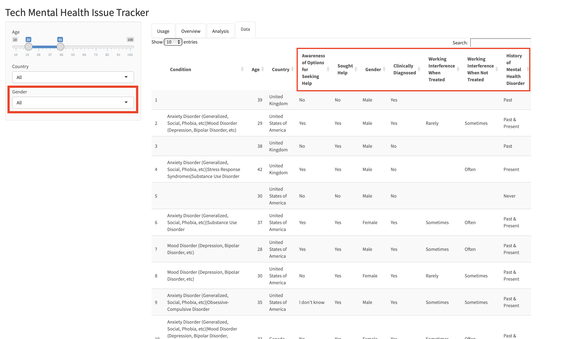
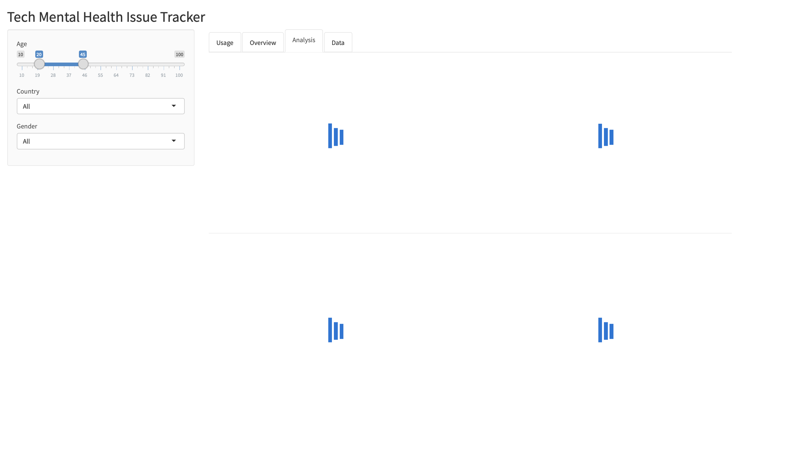

# Milestone 4

### What changes did you decide to implement given the time limit, and why do you think this is the best thing to focus on?

In this last phase of the project, we needed to decide the last implementations to work on. With this purpose, we first identified all the opportunities, considering the suggestions received from the feedback which we couldn't address on the previous phase for some reason, bugs, and other items we thought could be improved. We ended up with the following wishlist, sorted by priority:
- Replace original variable names shown on `Data` tab to more meaningful ones
- Add loading indicator to all visualizations
- Add gender filter option
- Automatically adjust chart sizes, proportionally to the window size
- Fix word cloud so it's plotted correctly for filter selections which result in only one condition reported
- Add the number of responses for the selected filter options
- Remove the box which is showing on the sidebar of `Usage` tab

The criteria for prioritizing tasks as above was so that we would address high value and low effort issues first. Specifically, we estimated the first two items would take little effort to implement, while at the same time significantly improving the reading experience in the `Data` tab and making the overall experience nicer and more fluid by adding the loading indicator. In the end, renaming the variables took longer than expected because it took a while to figure out how to use variable names that contained whitespace properly. We ended up managing to use the `colnames` parameter in the `datatable` function, which allowed us to set display names for the columns without having to rename the underlying variables. Adding the loading indicators was fairly simple. For that, we relied on the package `shinycssloaders`. We also decided to include a gender filter option since we noticed that the results varied significantly by gender for some analyses. The final item we managed to address was the automatic adjustment of the chart sizes. This was accomplished by setting the chart widths to `auto` on the `plotOutput` function calls in the UI module.

*Data tab with renamed variables and gender filter*

*Analysis tab with the loading indicators*

We found that given the time limit, we wouldn't be able to address the last three items. However, the first one was indirectly solved when we limited the country filter options to only countries with more than ten responses. We previously tried to work on the last item, but found that it required some effort to debug before we could find a fix. As to the number of responses, we figured that it would require design changes, as this information would be better suited on a dashboard panel, which we currently don't have. We thought of adding the information to the side bar as a compromise, but in the end decided against it.

### If you were to make the app again from scratch (or some other app in general), what would you do differently?

If we have to make an app again from scratch we would do more of the data wrangling with re-usable scripts. We would make the design simpler and try to convey the information with less plots. Also we would like to incorporate geographical information by using interactive maps. We are very intrigued by Shiny Dashboard, which we think is visually and functionally appealing, so implementing dashboard is one of our desired items. Also we would like to work with either a table or plot which takes live data and updates during runtime. However, this would depend on what data we have available.  

### What were the greatest challenges you faced in creating the final product?

The greatest challenges we faced while creating the final product were:

#### Wrangling the data
The dataset we used has a huge number of variables. As this was data from a survey, we had to clean up and standardize the answers, since people often answered questions in a different way, even if they meant the same thing. So we had to clean all of them to make sure we had proper categories to use in the visualizations. Also, for the purposes of our analysis, some answers could be simplified from a large number of options to a smaller set. So we needed to analyze similar responses and aggregate them into meaningful categories.

#### Making the word cloud interactive  
To build our word cloud, we needed to extract the main conditions from the survey responses. These responses could include more than one condition, so we needed to wrangle the data in order to separate sentences with multiple conditions into multiple records with a single condition each so that we could properly count each one, which we managed to do using regular expressions. Additionally, we wanted our word cloud to be interactive, with the ability to filter by Age, Country and Gender. This was challenging because the filtering had to happen on the original responses, prior to grouping the data and extracting the conditions. It took us time to figure out how to accomplish that, which we managed to do inside the reactive variable itself.

#### Rescaling the plot sizes with respect to Window size
When we tried to measure the Window size and pass that as input for width and height of each plot, it did not work. We were not able to get the height. Then we tried to set `auto` for both width and height, which again did not give the expected result. Finally, after a lot of Google searching, we realized the `height` can't be set to `auto` in Shiny App for fluid layouts. So we fixed the plot `height = 360px` but made the `width = auto`, which worked fine.

#### Making dynamic filters for specific Tabs  
We did not want to have our filters appear in the “Usage” tab. However we could not toggle the filters visibility with Shiny library. We needed to add `shinyjs` to add the ability to toggle the filters. It took some research and time to figure this out.

#### Library `dplyr`, created issue in Word cloud  
For our “Data” tab, we wanted to show the column names in a more readable format. We tried adding `dplyr` to use the column renaming function from code, so that we would not need to change them directly in the .csv. However, adding this package made our word cloud crash. It was a tricky issue to debug as everything else was working fine. In the end, the solution we came up with to the renaming problem was unrelated to `dplyr` and we were able to remove the library.
