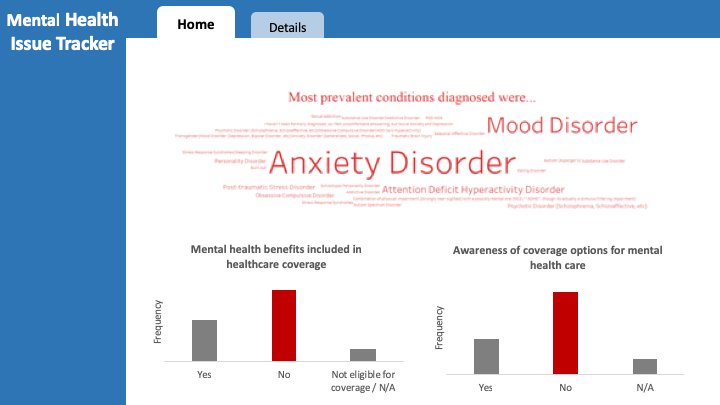
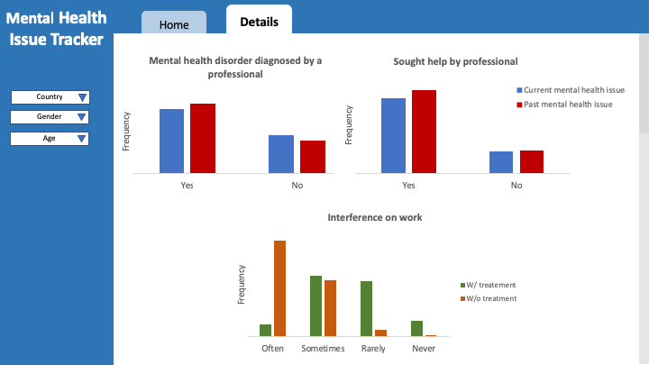

# Mental_Health_Issue_Tracker

Contributors:
- [Marcelle Chiriboga](https://github.com/mchiriboga)
- [Sayanti Ghosh](https://github.com/Sayanti86)

### Overview

Mental Health issue is a global challenge affecting people of every age, background and profession. According to Statistics Canada, mental illnesses cost Canadian employers billions of dollars in absenteeism or sick days, “presenteeism” (coming to work, even when the employee can’t work well), disability and other benefits, and lost productivity. Many times, employees who are already suffering from the issue do not reach out for help because either they are not comfortable with the benefit plan or they are not aware about it, which eventually affects their performance. If employers could get the information of how many employees are dealing with the issue, are actually reaching out for help, how much they are aware about the policies, and what is the intensity of work interference their health has, then it might be possible for the employer to enhance/add policies to spread more awareness and help employees. To address this situation, we propose to build an application for the employer which will provide them the information of how many of the employees are aware about the benefits plans. Also, it will filter on variables to show ratio about mentally ill employees who need help with respect to their health history. Also, the application will enable opportunities for the employer to understand the intensity of effect the illness is causing to their performance with respect to treatment received or not.

### Description of the data

We will be visualizing a dataset Mental Health Survey in Tech Company 2016, which has 1434 responses. Every response has 39 variables that describe the benefits the employers provide, how much employees(‘ID’, ‘Country’, ‘Age’, Gender’) are aware of those benefits and include them, employees mental health history(‘Family_hist’, ‘Have you had a mental health disorder in the past?’), their current health situation (‘Do you currently have a mental health disorder?’), if they are diagnosed by professional and seek help from the professional (‘Have you been diagnosed with a mental health condition by a medical professional?’,’ Have you ever sought treatment for a mental health issue from a mental health professional?’), also how much it affects their work when treated and when not treated effectively (‘If you have a mental health issue, do you feel that it interferes with your work when being treated effectively?’,’ If you have a mental health issue, do you feel that it interferes with your work when NOT being treated effectively?‘). The data also contains other information, such as whether employees feel comfortable discussing the issue with their supervisor, co-workers and how they think it might affect their professional career if discussed.

### Usage scenario & tasks

Mr. John Wick is the HR head of a tech company, and he recently received attrition report of the organization from his department, which does not look good and shows “Health” as the most frequent reason. To understand the reason in detail HR department conducts a mental health survey to get the feedback from employees to know about their work stress and how they feel about their mental health and benefits given to them. Mr. Wick wants to [explore] the survey result in order to [identify] what are the major mental health issues and how many employees are aware of the benefit plans provided and use them. This will give him an idea about the awareness of mental health benefit plans among the employees. When he logs on to “Mental Health Issue Tracker” he gets an overview page with most frequent mental health disorder names and see how many of the employees have added mental health plan in their healthcare coverage along with how many are actually aware of the benefit plan. He can [explore] the details of the responses in the Details tab, where he can filter the responses by variables like Country, Age, Gender to [compare] how many employees have been diagnosed by professional in past and present, how many reached out for professional help in past and present. He also gets the comparison between the work interference for the health issue for those who received treatment and without treatment. When he does so, he may notice that the majority of employees are either not aware of the benefit plans or do not include them in health coverage, along with that he might also notice employees who did not receive treatment have often complained of the issue hampering their work. He hypothesized that due to lack of awareness, employees are failing to reach out for professional help which is causing them to believe that they are suffering alone which eventually increases the attrition rate. Hence Mr. Wick decides that he needs to come up with initiatives to raise the awareness of mental health benefit plans among employees along with enhanced benefit plans which will encourage employees to seek professional treatment. This will help better their performance and also give them a comfortable work environment where they can feel that they are not alone.

### Description of the app & sketch

The app contains two tabs: Home and Details, where the users can switch between them by clicking the corresponding buttons in the top bar. In the Home page users will find some general outcomes from the survey: a wordcloud showing the main common health issues reported by the interviewees and two bar charts related to the employee’s awareness of the mental health care options provided by their employer’s health benefits packages. In the Details tab a set of dropdown lists allow users to play with the data, by customizing the charts displayed helping them carry out their analysis. Two of the charts display the percentage of people who have reported having had mental disorders in the past vs. people who reported a current mental health disorder, detailing whether they were diagnosed by a professional and if they sought professional help. The third chart compares the interference on work when a mental health disorder is treated effectively versus when it’s not.

